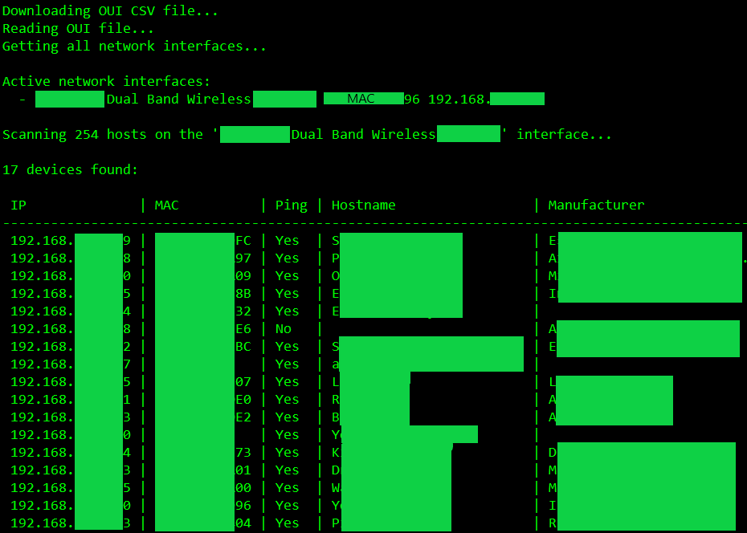

# What's on LAN

A scanner library to find basic networking info about devices in the local area network.

## Scan Output Example



## Code Example

See the summary comments inside the classes for more detailed info about what each class, method, and property does.

```cs
using YonatanMankovich.WhatsOnLan.Core;
using YonatanMankovich.WhatsOnLan.Core.Hardware;
using YonatanMankovich.WhatsOnLan.Core.OUI;
using YonatanMankovich.WhatsOnLan.Core.Helpers;

// The path were to save and load the OUI CSV file from.
string ouiCsvFilePath = "OUI.csv";

// If the file already exists, do not download it again.
if (!File.Exists(ouiCsvFilePath))
    await new OuiCsvDownloader().DownloadOuiCsvFileAsync(ouiCsvFilePath);

// Read the OUI CSV file into the matcher for matching later.
IOuiMatcher ouiMatcher = new OuiMatcher(OuiCsvFileHelpers.ReadOuiCsvFileLines(ouiCsvFilePath));

// Get all active network interfaces.
HashSet<PcapNetworkInterface> networkInterfaces = NetworkInterfaceHelpers.GetAllDistinctPcapNetworkInterfaces().ToHashSet();

// Run the scanner for every active interface separately.
foreach (PcapNetworkInterface networkInterface in networkInterfaces)
{
    // Create a network scanner.
    NetworkScanner networkScanner = new NetworkScanner(networkInterface)
    {
        // Set the options.
        Options = new NetworkScannerOptions
        {
            OuiMatcher = ouiMatcher,
            SendPings = true,
            SendArpRequest = true,
            ResolveHostnames = true,
            StripDnsSuffix = true,
            ShuffleIpAddresses = true,
            Repeats = 3
        }
    };

    Console.WriteLine($"\nScanning {networkInterface.NumberOfScannableHosts} hosts on the '{networkInterface.Name}' interface...");

    // Perform the scan and get only the results that have the device online.
    IList<IpScanResult> results = networkScanner.ScanNetwork().Where(r => r.IsOnline).ToList();

    /////////////// Write the results in a neat table ///////////////

    // First number is the number of the params later. Minus is left align. Last number is the column width.
    string format = " {0,-16}| {1,-13}| {2,-5}| {3,-25}| {4}";
    Console.WriteLine($"\n{results.Count} devices found:\n");
    Console.WriteLine(string.Format(format, "IP", "MAC", "Ping", "Hostname", "Manufacturer")); // Headers
    Console.WriteLine(new string('-', format.Length + 16 + 13 + 25)); // Draw a line --------- under the headers.

    // Write the results themselves.
    foreach (IpScanResult result in results)
        Console.WriteLine(string.Format(format, result.IpAddress.ToSortableString(), result.MacAddress,
            result.RespondedToPing ? "Yes" : "No", result.Hostname, result.Manufacturer));
}
```

## Note

The MAC address resolver sends ARP packets to all hosts on the network at once and awaits for responses instead of doing it host by host. The timeout can be adjusted at `NetworkScannerOptions.ArpTimeout`. The default is one second -- which is more than enough for most cases.
